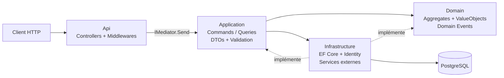

# pass-facile-api

[](https://github.com/ezekielncm/pass-facile-api/actions/workflows/ci.yml)
[](https://dotnet.microsoft.com/)
[](https://www.postgresql.org/)
[](LICENSE.txt)

API **.NET 10** de billetterie événementielle, construite selon les principes de **Clean Architecture** avec **CQRS** (MediatR), authentification **JWT par OTP**, **Swagger/OpenAPI**, **Serilog** et **PostgreSQL**.

---

## Table des matières

- [Architecture](#architecture)
- [Stack technique](#stack-technique)
- [Structure du projet](#structure-du-projet)
- [Prérequis](#prérequis)
- [Démarrage rapide](#démarrage-rapide)
- [Configuration](#configuration)
- [Base de données](#base-de-données)
- [Docker](#docker)
- [Endpoints API](#endpoints-api)
- [Tests](#tests)
- [CI/CD](#cicd)
- [Commandes utiles](#commandes-utiles)
- [License](#license)

---

## Architecture

Le flux principal suit le pattern **CQRS** :
**HTTP → Controllers → Application (Commands/Queries via MediatR) → Domain → Infrastructure (EF Core, services externes)**



### Principes appliqués

| Principe | Détails |
|----------|---------|
| **Clean Architecture** | 4 couches avec dépendances orientées vers le centre (Domain) |
| **CQRS** | Séparation Commands / Queries via MediatR |
| **Domain-Driven Design** | Aggregates, Value Objects, Domain Events |
| **Result Pattern** | Pas d'exceptions métier — retour de `Result<T>` |
| **Unit of Work** | Transaction cohérente via `IUnitOfWork` |

### Pipeline MediatR (Behaviors)

Chaque commande/requête traverse dans l'ordre :

1. **`ValidationBehavior`** — validation FluentValidation avant exécution
2. **`TransactionBehavior`** — encapsulation dans une transaction DB
3. **`LoggingBehavior`** — journalisation de la requête et de la durée

---

## Stack technique

### Frameworks & Runtime

| Composant | Version |
|-----------|---------|
| .NET | 10.0 |
| ASP.NET Core | 10.0 |
| C# | 14 |

### Packages principaux

| Package | Version | Couche |
|---------|---------|--------|
| MediatR | 14.1.0 | Api, Application |
| FluentValidation | 12.1.1 | Application |
| EF Core (Npgsql) | 10.0.0 | Infrastructure |
| ASP.NET Core Identity | 10.0.3 | Infrastructure |
| Serilog.AspNetCore | 10.0.0 | Api |
| Swashbuckle (Swagger) | 6.5.0 | Api |
| JWT Bearer Auth | 10.0.3 | Api |
| xUnit | 2.9.3 | Tests |

---

## Structure du projet

```
pass-facile-api/
+-- src/
|   +-- Api/                          # Couche présentation
|   |   +-- Controllers/              # AuthController, UsersController, EventsController, ...
|   |   +-- Contracts/                # Request DTOs (Auth, Events, Users, Organizers)
|   |   +-- MiddleWares/              # GlobalExceptionHandlerMiddleware
|   |   +-- Program.cs               # Point d'entrée + configuration du pipeline
|   |   +-- appsettings.json
|   |   +-- Dockerfile
|   |
|   +-- Application/                  # Cas d'usage (CQRS)
|   |   +-- Auth/
|   |   |   +-- Commands/            # RequestOtp, VerifyOtp, RefreshToken
|   |   |   +-- Queries/             # CurrentUser
|   |   |   +-- DTOs/
|   |   +-- Events/
|   |   |   +-- Commands/            # PostEvent
|   |   |   +-- DTOs/
|   |   +-- Users/
|   |   |   +-- Commands/            # UpdateProfile
|   |   |   +-- DTOs/
|   |   +-- Common/
|   |   |   +-- Behaviors/           # Validation, Transaction, Logging
|   |   |   +-- Exceptions/          # NotFoundException, ValidationException, ...
|   |   |   +-- Interfaces/          # Persistence, Auth, Services, Messaging
|   |   |   +-- Models/              # Result<T>, Error, PagedResult<T>
|   |   +-- DependencyInjection.cs
|   |
|   +-- Domain/                       # Modèle métier (aucune dépendance externe)
|   |   +-- Aggregates/
|   |   |   +-- Event/               # Event, TicketCategory, PromoCode
|   |   |   +-- User/                # User, OtpCode, UserRole
|   |   |   +-- Sales/               # Order
|   |   |   +-- Ticketing/           # Ticket
|   |   |   +-- Finance/             # OrganizerWallet
|   |   |   +-- AccessControl/       # ScanSession
|   |   |   +-- Notifications/       # NotificationRequest
|   |   +-- ValueObjects/            # Money, PhoneNumber, Venue, Capacity, EventSlug, ...
|   |   +-- DomainEvents/            # EventCreated, UserRegistered, OtpVerified, ...
|   |   +-- Common/                  # Entity, AggregateRoot, ValueObject, DomainEvent, Guard
|   |
|   +-- Infrastructure/               # Implémentations techniques
|       +-- Persistences/
|       |   +-- AppDbContext.cs       # Contexte EF Core métier
|       |   +-- IdentityDbContext.cs  # Contexte ASP.NET Identity
|       |   +-- UnitOfWork.cs
|       |   +-- Repositories/        # EfCoreEventRepository, EfCoreOrderRepository, ...
|       +-- Auth/                     # JwtTokenGenerator, OtpService, AuthService, CurrentUserService
|       +-- Identity/                 # AppUser, AppRole, UserRoleManager
|       +-- Services/                 # EventPublisher
|       +-- Migrations/
|       +-- DependencyInjection.cs
|
+-- tests/
|   +-- DomainUnitTests/              # Tests unitaires du domaine
|   +-- ApplicationUnitTests/         # Tests unitaires de la couche application
|   +-- ApiIntegrationTests/          # Tests d'intégration API
|   +-- InfrastructureIntegrationTests/ # Tests d'intégration infrastructure
|
+-- docker-compose.yml                # PostgreSQL 16 + pgAdmin + API
+-- .github/workflows/ci.yml          # Pipeline CI GitHub Actions
+-- LICENSE.txt                       # MIT
```

---

## Prérequis

| Outil | Version | Requis |
|-------|---------|--------|
| [.NET SDK](https://dotnet.microsoft.com/download) | 10.0+ | ✅ |
| [Docker Desktop](https://www.docker.com/products/docker-desktop/) | Récent | Recommandé |
| [dotnet-ef](https://learn.microsoft.com/ef/core/cli/dotnet) | Récent | Pour les migrations |

---

## Démarrage rapide

### 1. Cloner le dépôt

```bash
git clone https://github.com/ezekielncm/pass-facile-api.git
cd pass-facile-api
```

### 2. Lancer PostgreSQL + pgAdmin

```bash
docker compose up -d postgres pgadmin
```

### 3. Configurer les secrets locaux

```bash
# JWT (obligatoire — au moins 32 caractères)
dotnet user-secrets --project src/Api set "JwtSettings:SecretKey" "REMPLACER_PAR_UN_SECRET_LONG_32+_CARACTERES"

# Connection strings (nécessaire si l'API tourne en dehors de Docker)
dotnet user-secrets --project src/Api set "ConnectionStrings:DefaultConnection"  "Host=localhost;Port=5432;Database=pf;Username=pf_user;Password=pf_pwd"
dotnet user-secrets --project src/Api set "ConnectionStrings:IdentityConnection" "Host=localhost;Port=5432;Database=pf_identity;Username=pf_user;Password=pf_pwd"
```

### 4. Appliquer les migrations

```bash
dotnet tool install --global dotnet-ef   # si pas encore installé

dotnet ef database update --project src/Infrastructure --startup-project src/Api --context AppDbContext
dotnet ef database update --project src/Infrastructure --startup-project src/Api --context IDbContext
```

### 5. Lancer l'API

```bash
dotnet run --project src/Api
```

L'API démarre sur le port configuré dans `launchSettings.json`. En mode **Development**, Swagger UI est disponible à la racine (`/`).

---

## Configuration

La configuration est lue depuis (par ordre de priorité croissante) :

1. `src/Api/appsettings.json`
2. `appsettings.{Environment}.json`
3. Variables d'environnement
4. **User Secrets** (recommandé en local)

### Sections de configuration

| Section | Clés principales | Stockage recommandé |
|---------|-----------------|---------------------|
| `JwtSettings` | `SecretKey`, `Issuer`, `Audience`, `ExpiryMinutes` | User Secrets / Env vars |
| `ConnectionStrings` | `DefaultConnection`, `IdentityConnection` | User Secrets / Env vars |
| `ExternalApis:Ikkodi` | `BaseUrl`, `ApiKey` | User Secrets / Env vars |
| `Serilog` | Configuration standard Serilog | `appsettings.json` |

> ⚠️ **Ne jamais commiter de secrets** (clés JWT, tokens API, mots de passe) dans `appsettings.json`. Utiliser User Secrets ou des variables d'environnement.

---

## Base de données

### Deux DbContexts

| Contexte | Connection String | Base par défaut | Usage |
|----------|------------------|----------------|-------|
| `AppDbContext` | `DefaultConnection` | `pf` | Données métier (Events, Orders, Tickets, …) |
| `IDbContext` (IdentityDbContext) | `IdentityConnection` | `pf_identity` | ASP.NET Identity (Users, Roles, Tokens) |

### Valeurs par défaut Docker Compose

| Paramètre | Valeur |
|-----------|--------|
| Host | `localhost` (hors Docker) / `postgres` (dans Docker) |
| Port | `5432` |
| Utilisateur | `pf_user` |
| Mot de passe | `pf_pwd` |
| Base métier | `pf` |

> **Important :** Dans `appsettings.json`, le `Host` pointe vers `postgres` (nom du service Docker). Si vous exécutez l'API hors Docker (`dotnet run`), surchargez le host en `localhost` via User Secrets.

### Créer une nouvelle migration

```bash
# Migration AppDbContext
dotnet ef migrations add <NomMigration> --project src/Infrastructure --startup-project src/Api --context AppDbContext

# Migration IDbContext (Identity)
dotnet ef migrations add <NomMigration> --project src/Infrastructure --startup-project src/Api --context IDbContext
```

---

## Docker

### Services Docker Compose

| Service | Image | Port exposé | Description |
|---------|-------|-------------|-------------|
| `postgres` | `postgres:16-alpine` | `5432` | Base de données PostgreSQL |
| `pgadmin` | `dpage/pgadmin4:latest` | `5050` | Interface d'administration DB |
| `api` | Build local (`src/Api/Dockerfile`) | `8080` | API ASP.NET Core |

### Commandes Docker

```bash
# Lancer tous les services
docker compose up -d

# Lancer uniquement la base + pgAdmin
docker compose up -d postgres pgadmin

# Lancer l'API dans Docker (build inclus)
docker compose up -d --build api

# Voir les logs
docker compose logs -f api

# Arrêter tout
docker compose down
```

### pgAdmin

- **URL :** http://localhost:5050
- **Email :** `admin@pf.com`
- **Mot de passe :** `admin`

---

## Endpoints API

Base path : `api/<controller>`

### Auth (`AuthController`)

| Méthode | Route | Auth | Description |
|---------|-------|------|-------------|
| `POST` | `/api/auth/send-otp` | ❌ Anonyme | Envoyer un OTP par SMS |
| `POST` | `/api/auth/verify-otp` | ❌ Anonyme | Vérifier un OTP et obtenir un JWT |
| `POST` | `/api/auth/refresh` | ✅ JWT | Rafraîchir un token via refresh token |

### Users (`UsersController`)

| Méthode | Route | Auth | Description |
|---------|-------|------|-------------|
| `PUT` | `/api/users/me/profile` | ✅ JWT | Mettre à jour le profil utilisateur courant |

### Events (`EventsController`)

| Méthode | Route | Auth | Description |
|---------|-------|------|-------------|
| `POST` | `/api/events` | ✅ JWT | Créer un événement *(en cours)* |

### Contrôleurs planifiés (sans endpoints actifs)

Les contrôleurs suivants sont créés mais ne déclarent pas encore d'actions :

- `CategoriesController` — Gestion des catégories d'événements
- `MediaController` — Upload/gestion de médias
- `OrganizersController` — Profils organisateurs
- `OrdersController` — Commandes / achats
- `PaymentsController` — Paiements
- `ScanController` — Contrôle d'accès / scan de billets
- `TicketsController` — Gestion des billets

### Endpoints utilitaires

| Route | Description |
|-------|-------------|
| `GET /health` | Health check (PostgreSQL + self) |
| `GET /` | Swagger UI *(Development uniquement)* |
| `GET /swagger/v1/swagger.json` | Spécification OpenAPI JSON |

---

## Tests

Le projet inclut **4 projets de tests** basés sur **xUnit** :

| Projet | Type | Cible |
|--------|------|-------|
| `tests/DomainUnitTests` | Unitaire | Aggregates, Value Objects, Domain Events |
| `tests/ApplicationUnitTests` | Unitaire | Commands, Queries, Behaviors |
| `tests/ApiIntegrationTests` | Intégration | Controllers, pipeline HTTP |
| `tests/InfrastructureIntegrationTests` | Intégration | Repositories, DbContexts |

```bash
# Lancer tous les tests
dotnet test

# Lancer un projet de tests spécifique
dotnet test tests/DomainUnitTests

# Avec verbosité détaillée
dotnet test --verbosity detailed

# Avec couverture de code (coverlet)
dotnet test --collect:"XPlat Code Coverage"
```

---

## CI/CD

Le pipeline **GitHub Actions** (`.github/workflows/ci.yml`) s'exécute sur chaque `push` / `pull_request` vers `main` ou `master` :

| Job | Étapes |
|-----|--------|
| **build-and-test** | Restore → Build (Release) → Test |
| **docker-build** | Build de l'image Docker (`src/Api/Dockerfile`) — sans push |

---

## Commandes utiles

```bash
# Build
dotnet build

# Build Release
dotnet build --configuration Release

# Lancer l'API
dotnet run --project src/Api

# Tests
dotnet test

# Restaurer les packages
dotnet restore

# Nettoyer les artefacts
dotnet clean
```

---

## License

Ce projet est sous licence **MIT** — voir [LICENSE.txt](LICENSE.txt) pour les détails.

Copyright © 2026 NACOULMA W.Ezekiel